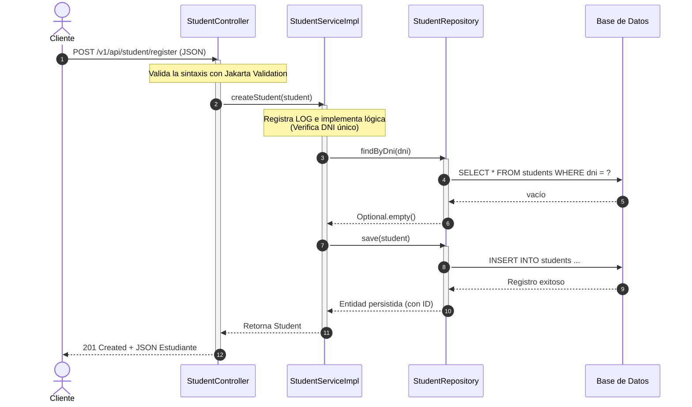

# Microservicio de Estudiantes (student-service)

Este proyecto es un microservicio diseñado para una hackathon universitaria. Su propósito es servir de plantilla educativa y funcional, implementando un CRUD completo de estudiantes bajo tecnologías modernas como **Java 21**, **Spring Boot 3.x**, **Docker**, **Docker Compose** y **Kubernetes**.

---

## Índice
1. [Conceptos Básicos](#1-conceptos-básicos)
2. [Objetivo del Proyecto](#2-objetivo-del-proyecto)
3. [Arquitectura y Estructura del Proyecto](#3-arquitectura-y-estructura-del-proyecto)
4. [Flujo de una Petición](#4-flujo-de-una-petición)
5. [Explicación del pom.xml y Dependencias](#5-explicación-del-pomxml-y-dependencias)
6. [Configuración y Perfiles de Base de Datos](#6-configuración-y-perfiles-de-base-de-datos)
7. [Cómo Ejecutar el Proyecto Localmente](#7-cómo-ejecutar-el-proyecto-localmente)
8. [Pruebas de Endpoints (Postman / cURL)](#8-pruebas-de-endpoints-postman--curl)
9. [Explicación del Dockerfile y Docker Compose](#9-explicación-del-dockerfile-y-docker-compose)
10. [Explicación de los Manifiestos de Kubernetes](#10-explicación-de-los-manifiestos-de-kubernetes)
11. [Comandos de Git, Docker y Kubernetes](#11-comandos-de-git-docker-y-kubernetes)
12. [Errores Comunes y Soluciones](#12-errores-comunes-y-soluciones)
13. [Buenas Prácticas Aplicadas](#13-buenas-prácticas-aplicadas)

---

## 1. Conceptos Básicos

### ¿Qué es Spring Boot?
**Spring Boot** es un framework de Java diseñado para simplificar la creación de aplicaciones autónomas y listas para producción basadas en el ecosistema de Spring. Su principio rector es "convención sobre configuración", proporcionando autoconfiguraciones para bases de datos, servidores web (como Tomcat embebido) y seguridad, permitiendo a los desarrolladores enfocarse en la lógica del negocio sin perder tiempo en configuraciones repetitivas.

### ¿Qué es un Microservicio?
Un **microservicio** es un patrón arquitectónico en el que una aplicación grande y compleja se descompone en un conjunto de servicios más pequeños, autónomos, acoplados de forma laxa y enfocados en realizar una sola función de negocio (Single Responsibility). Cada microservicio tiene su propio ciclo de vida de desarrollo, despliegue y su propia base de datos, comunicándose con otros servicios a través de protocolos ligeros como HTTP/REST o mensajería asíncrona.

---

## 2. Objetivo del Proyecto
El objetivo es proveer el microservicio maestro **student-service**, que implementa un CRUD (Crear, Leer, Actualizar, Eliminar) de estudiantes. Está optimizado para entornos de hackathon: es sumamente rápido de desplegar, fácil de entender, cuenta con soporte multi-perfil (H2 y MySQL) y posee plantillas listas de contenedores y manifiestos de Kubernetes.

---

## 3. Arquitectura y Estructura del Proyecto

### Estructura de Carpetas
El proyecto está estructurado de la siguiente forma:

```text
student-service/
│
├── src/
│   ├── main/
│   │   ├── java/
│   │   │   └── com/
│   │   │       └── studentservice/
│   │   │           ├── controller/           # Endpoints HTTP / REST
│   │   │           ├── service/              # Interfaces de la lógica de negocio
│   │   │           │   ├── StudentService.java
│   │   │           │   └── impl/
│   │   │           │       └── StudentServiceImpl.java # Implementación lógica
│   │   │           ├── repository/           # Interacción con la base de datos (JPA)
│   │   │           ├── model/                # Entidades del dominio (Student)
│   │   │           ├── config/               # Configuraciones globales (CORS, etc.)
│   │   │           ├── exception/            # Gestión global de errores
│   │   │           └── StudentServiceApplication.java # Clase principal
│   │   │
│   │   └── resources/
│   │       ├── application.yml               # Configuración común base
│   │       ├── application-dev.yml           # Perfil desarrollo (H2 Database)
│   │       ├── application-prod.yml          # Perfil producción (MySQL Database)
│   │       ├── static/                       # Recursos estáticos
│   │       └── templates/                    # Plantillas de renderizado
│   │
│   └── test/                                 # Pruebas unitarias/integración
│
├── Dockerfile                                # Empaquetado optimizado en Docker
├── docker-compose.yml                        # Orquestación local (Microservicio, MySQL, Nginx)
├── k8s/                                      # Despliegue en Kubernetes
│   ├── namespace.yml
│   ├── secret.yml
│   ├── deployment.yml
│   └── service.yml
│
├── pom.xml                                   # Configuración de dependencias de Maven
└── README.md                                 # Guía didáctica del proyecto
```

### Explicación de Paquetes y Clases
- **`controller`**: Recibe las peticiones HTTP directas del cliente, valida la información entrante (`@Valid`) y retorna respuestas unificadas.
  - *`StudentController.java`*: Expone endpoints REST en la ruta `/v1/api/student`.
- **`service` / `service.impl`**: Contiene las reglas del negocio, la lógica de validación (como evitar DNIs duplicados) y llamadas transaccionales a la base de datos.
  - *`StudentService.java`*: Define las operaciones del CRUD.
  - *`StudentServiceImpl.java`*: Implementa la interfaz, maneja las excepciones del negocio y registra trazas de eventos (logs).
- **`repository`**: Provee acceso a la base de datos mediante interfaces mapeadas por JPA.
  - *`StudentRepository.java`*: Extiende `JpaRepository`, permitiendo operaciones estándar y consultas personalizadas como `findByDni`.
- **`model`**: Define las entidades persistentes y las reglas de validación físicas.
  - *`Student.java`*: Entidad que representa la tabla `students`. Mapea columnas y define restricciones como `@NotBlank`.
- **`config`**: Configuración de bajo nivel e infraestructura de la aplicación.
  - *`WebConfig.java`*: Configura CORS globalmente para permitir integración con aplicaciones cliente.
- **`exception`**: Captura errores y define respuestas coherentes.
  - *`ResourceNotFoundException.java`*: Lanzada cuando un estudiante no se encuentra por su ID.
  - *`ErrorResponse.java`*: Plantilla de retorno JSON en caso de error.
  - *`GlobalExceptionHandler.java`*: `@ControllerAdvice` que intercepta excepciones y devuelve `ErrorResponse` formateados.

---

## 4. Flujo de una Petición
Cuando el cliente realiza un llamado al microservicio, la información viaja de la siguiente manera:



---

## 5. Explicación del pom.xml y Dependencias

El archivo `pom.xml` es el corazón de la administración de dependencias bajo Maven.

```xml
<!-- Define el Starter Parent de Spring Boot, aportando versiones compatibles y por defecto para todas las librerías oficiales -->
<parent>
    <groupId>org.springframework.boot</groupId>
    <artifactId>spring-boot-starter-parent</artifactId>
    <version>3.2.5</version>
</parent>
```

### Dependencias Principales
1. **`spring-boot-starter-web`**: Incluye dependencias para construir aplicaciones REST e inicializar un servidor Tomcat web embebido.
2. **`spring-boot-starter-data-jpa`**: Incluye Hibernate y las APIs estándar de persistencia de Java para comunicarse con bases de datos SQL de manera orientada a objetos.
3. **`spring-boot-starter-validation`**: Hibernate Validator para dar soporte a anotaciones de validación física como `@NotBlank`, `@Size` y `@NotNull` en los controladores y entidades.
4. **`h2`**: Base de datos en memoria ligera. Muy rápida de iniciar, ideal para fases de desarrollo rápido o desarrollo local rápido.
5. **`mysql-connector-j`**: Driver JDBC necesario para comunicarse con bases de datos MySQL en entornos de producción.
6. **`lombok`**: Librería que genera en tiempo de compilación métodos repetitivos como Getters, Setters, constructores, y constructores Builder, manteniendo el código limpio.

---

## 6. Configuración y Perfiles de Base de Datos

La aplicación sigue el enfoque de **múltiples perfiles de Spring** para alternar entornos fácilmente.

### `application.yml` (Base)
Establece el nombre de la aplicación y expone el puerto mediante la variable `${SERVER_PORT:8090}` (por defecto `8090`). Decide qué perfil activar usando `${SPRING_PROFILES_ACTIVE:dev}`.

### `application-dev.yml` (Desarrollo - H2)
Configura una base de datos en memoria llamada `studentdb` que se crea al iniciar y se destruye al apagar el servidor. Activa el H2 Console en la ruta `/h2-console` para consultas interactivas.

### `application-prod.yml` (Producción - MySQL)
Prepara la conexión con MySQL utilizando variables de entorno para que sea desacoplada de código:
- `DB_HOST`: Host del servidor MySQL (Defecto: `localhost`).
- `DB_PORT`: Puerto (Defecto: `3306`).
- `DB_NAME`: Nombre de la base de datos (Defecto: `studentdb`).
- `DB_USER`: Usuario (Defecto: `root`).
- `DB_PASSWORD`: Contraseña (Defecto: `rootpassword`).

---

## 7. Cómo Ejecutar el Proyecto Localmente

### Prerrequisitos
- Tener instalado **Java 21** de JDK.
- Tener instalado **Maven** (o usar el ejecutable `mvn` local).

### Ejecutar con H2 (Desarrollo)
1. Navega a la carpeta raíz del proyecto `student-service`.
2. Ejecuta la aplicación levantando el perfil `dev`:
   ```bash
   mvn spring-boot:run -Dspring-boot.run.profiles=dev
   ```
3. El microservicio estará listo en el puerto **8090**.
4. Puedes acceder a la consola interactiva de H2 en:
   - **URL**: `http://localhost:8090/h2-console`
   - **JDBC URL**: `jdbc:h2:mem:studentdb`
   - **User**: `sa`
   - **Password**: `password` (o vacío si no se requiere contraseña)

### Ejecutar con MySQL
1. Asegúrate de tener una base de datos MySQL corriendo.
2. Configura las variables correspondientes o modifique su `application-prod.yml` con sus credenciales locales.
3. Ejecute:
   ```bash
   mvn spring-boot:run -Dspring-boot.run.profiles=prod
   ```

---

## 8. Pruebas de Endpoints (Postman / cURL)

### 1. Listar Estudiantes (GET)
**URL**: `http://localhost:8090/v1/api/student/list`
```bash
curl -X GET http://localhost:8090/v1/api/student/list
```

### 2. Registrar Estudiante (POST)
**URL**: `http://localhost:8090/v1/api/student/register`
**Body (JSON)**:
```json
{
  "dni": "12345678",
  "firstName": "Aixa",
  "lastName": "Gonzales",
  "promotion": "2026-I",
  "date": "2026-07-02"
}
```
```bash
curl -X POST http://localhost:8090/v1/api/student/register \
  -H "Content-Type: application/json" \
  -d "{\"dni\":\"12345678\",\"firstName\":\"Aixa\",\"lastName\":\"Gonzales\",\"promotion\":\"2026-I\",\"date\":\"2026-07-02\"}"
```

### 3. Buscar Estudiante por ID (GET)
**URL**: `http://localhost:8090/v1/api/student/find/1`
```bash
curl -X GET http://localhost:8090/v1/api/student/find/1
```

### 4. Actualizar Estudiante (PUT)
**URL**: `http://localhost:8090/v1/api/student/update/1`
**Body (JSON)**:
```json
{
  "dni": "12345678",
  "firstName": "Aixa Editado",
  "lastName": "Gonzales Perez",
  "promotion": "2026-II",
  "date": "2026-07-02"
}
```
```bash
curl -X PUT http://localhost:8090/v1/api/student/update/1 \
  -H "Content-Type: application/json" \
  -d "{\"dni\":\"12345678\",\"firstName\":\"Aixa Editado\",\"lastName\":\"Gonzales Perez\",\"promotion\":\"2026-II\",\"date\":\"2026-07-02\"}"
```

### 5. Eliminar Estudiante (DELETE)
**URL**: `http://localhost:8090/v1/api/student/delete/1`
```bash
curl -X DELETE http://localhost:8090/v1/api/student/delete/1
```

---

## 9. Explicación del Dockerfile y Docker Compose

### Explicación línea por línea del Dockerfile

```dockerfile
# ETAPA 1: Construcción del binario
FROM maven:3.9.6-eclipse-temurin-21-alpine AS build
# Establece el directorio de trabajo interno en /app
WORKDIR /app

# Copia el pom.xml de dependencias para descargar y cachear las librerías
COPY pom.xml .
RUN mvn dependency:go-offline -B

# Copia el código fuente e inicia el empaquetado omitiendo pruebas unitarias
COPY src ./src
RUN mvn package -DskipTests

# ETAPA 2: Ejecución ligera
FROM eclipse-temurin:21-jre-alpine
WORKDIR /app

# Crea un grupo de sistema (-S) y un usuario para no correr bajo root
RUN addgroup -S appgroup && adduser -S appuser -G appgroup

# Copia únicamente el archivo JAR empaquetado desde la etapa de compilación
COPY --from=build /app/target/student-service-1.0.0.jar app.jar

# Asigna la propiedad de los archivos del directorio de trabajo al usuario no root
RUN chown -R appuser:appgroup /app

# Indica al contenedor que se ejecute bajo el usuario appuser
USER appuser

# Documenta el puerto interno expuesto
EXPOSE 8090

# Perfil producción por defecto en entornos de contenedores
ENV SPRING_PROFILES_ACTIVE=prod

# Comando ejecutor
ENTRYPOINT ["java", "-jar", "app.jar"]
```

### Explicación del docker-compose.yml
El archivo orquesta tres contenedores en una red virtual común:
1. **`mysql`**: Levanta una base de datos en el puerto `3306`. Utiliza volúmenes físicos para garantizar la persistencia de datos y un `healthcheck` que valida que la BD esté activa antes de que inicie el microservicio.
2. **`student-service`**: Compila localmente usando el Dockerfile y expone el puerto `8091` hacia el puerto `8090` del contenedor. Utiliza variables de entorno para apuntar a la base de datos `mysql` mediante su nombre de host del contenedor.
3. **`nginx`**: Actúa como proxy inverso. Escucha en el puerto `8092` y redirige internamente las solicitudes hacia el contenedor `student-service` en su puerto interno `8090`.

---

## 10. Explicación de los Manifiestos de Kubernetes

Los recursos de Kubernetes se encuentran en `/k8s`.

### `namespace.yml`
Declara el espacio lógico `aixa-namespace`. Esto aísla los recursos del microservicio de otros despliegues dentro del clúster de Kubernetes.

### `secret.yml`
Almacena credenciales o datos sensibles codificados en Base64. En este caso, guarda la clave `app-port` con valor `ODA5Mw==` (que corresponde a `8093`), protegiendo el puerto interno del microservicio.

### `deployment.yml`
Define el estado deseado de los pods.
- **Réplicas**: 3 pods idénticos para balancear la carga y asegurar alta disponibilidad.
- **Imagen**: Apunta a `aixa949/hf-232-01-aixa-gonzales:latest`.
- **Puerto**: Levanta en el puerto `8093` alimentándose dinámicamente de la variable de entorno `SERVER_PORT` cargada desde el `Secret` `aixa-secret`.

### `service.yml`
Expone el despliegue al exterior.
- **Tipo**: `NodePort`.
- **Puerto**: `80`. Expone el servicio en el puerto 80 dentro del clúster.
- **TargetPort**: `8093`. Redirecciona las peticiones del puerto 80 hacia el puerto 8093 de los pods del microservicio.

---

## 11. Comandos de Git, Docker y Kubernetes

### Comandos de Git
```bash
# Inicializar repositorio local
git init

# Crear y cambiar a la rama develop
git checkout -b develop

# Añadir todos los archivos creados
git add .

# Hacer commit del proyecto base
git commit -m "feat: inicializacion de student-service con Docker y Kubernetes"
```

### Comandos de Docker y Docker Compose
```bash
# Compilar y levantar la arquitectura completa (Microservicio, MySQL, Nginx) en segundo plano
docker compose up -d

# Ver el estado y salud de los contenedores
docker compose ps

# Ver logs en tiempo real del microservicio
docker compose logs -f student-service

# Apagar y eliminar los contenedores y redes creadas
docker compose down
```

### Comandos de Docker Hub
```bash
# Construir la imagen localmente especificando la etiqueta de Docker Hub
docker build -t aixa949/hf-232-01-aixa-gonzales:latest .

# Iniciar sesión en Docker Hub
docker login

# Subir la imagen a su repositorio
docker push aixa949/hf-232-01-aixa-gonzales:latest
```

### Comandos de Kubernetes
```bash
# Crear todos los recursos en orden correcto
kubectl apply -f k8s/namespace.yml
kubectl apply -f k8s/secret.yml
kubectl apply -f k8s/deployment.yml
kubectl apply -f k8s/service.yml

# Consultar el estado de los recursos creados
kubectl get all -n aixa-namespace

# Realizar port-forward de puerto 9094 (local) hacia puerto 80 (servicio de K8s)
kubectl port-forward service/aixa-service 9094:80 -n aixa-namespace
```

---

## 12. Errores Comunes y Soluciones

1. **`Port 8090 already in use`**:
   - *Causa*: Otro proceso está usando el puerto de red.
   - *Solución*: Modifica la propiedad `server.port` en `application.yml` o corre con `SERVER_PORT=8095 mvn spring-boot:run`.

2. **`Access denied for user 'root'@'...'` en producción**:
   - *Causa*: Las credenciales de MySQL pasadas por variables no coinciden con las del contenedor de BD.
   - *Solución*: Verifica las contraseñas definidas en `docker-compose.yml` e iguala las variables de entorno de `student-service`.

3. **`Pod crashloopbackoff` en Kubernetes**:
   - *Causa*: Kubernetes no puede jalar la imagen o la aplicación falla en iniciar (ej: falta de base de datos activa).
   - *Solución*: Inspeccione los logs con `kubectl logs deployment/aixa-deployment -n aixa-namespace`.

---

## 13. Buenas Prácticas Aplicadas
- **Inyección de Dependencias por Constructor**: Se utiliza Lombok `@RequiredArgsConstructor` para inyectar servicios en lugar del obsoleto `@Autowired`.
- **Estandarización de Respuestas de Error**: Uso de `@ControllerAdvice` y una clase `ErrorResponse` coherente para que las aplicaciones frontend reciban siempre el mismo formato estructurado de error.
- **Seguridad en Docker**: Uso de imágenes ligeras Alpine y bloqueo de acceso root ejecutando la JVM bajo un usuario con privilegios restringidos.
- **Transaccionalidad Correcta**: Uso de `@Transactional(readOnly = true)` en operaciones de lectura para mejorar el rendimiento de JPA, y `@Transactional` común en escrituras.
